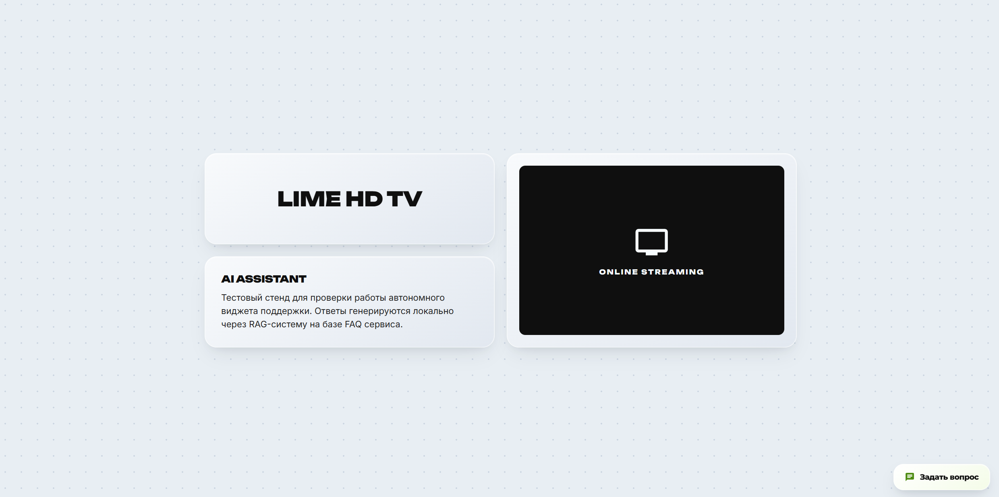
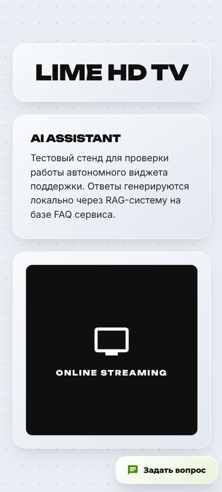
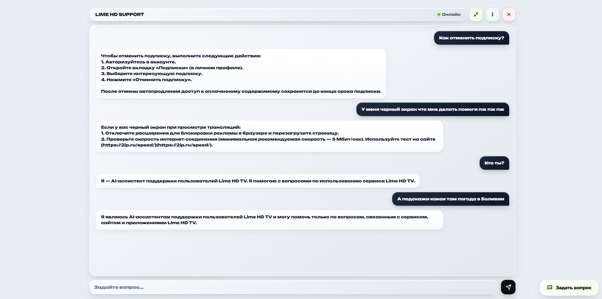
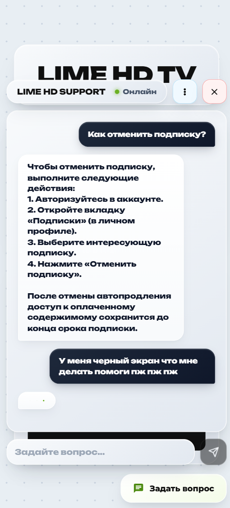
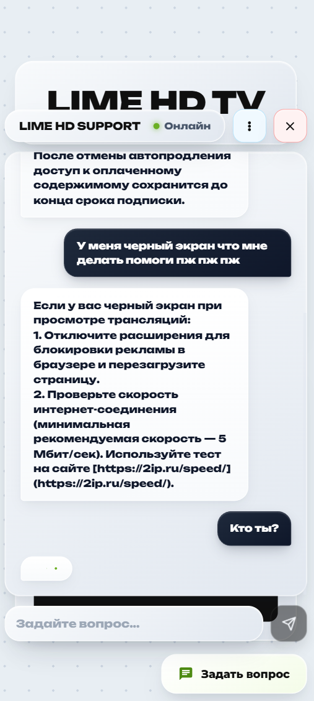
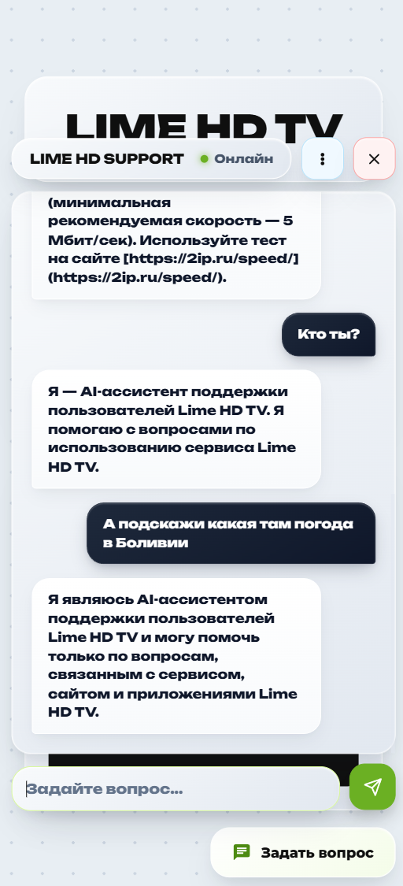
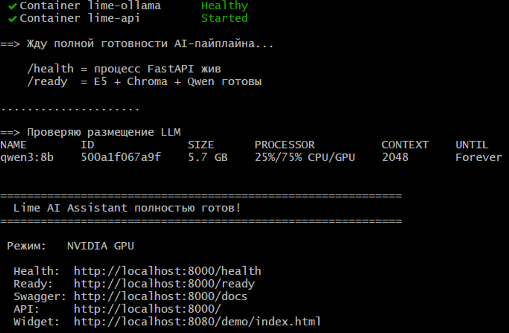
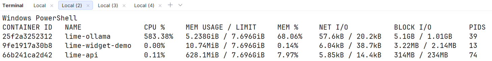

# Lime HD TV — AI-ассистент поддержки пользователей

Локальный AI-ассистент поддержки пользователей Lime HD TV, построенный по архитектуре **FAQ → embeddings → ChromaDB → RAG → локальная LLM → REST API → JavaScript-виджет**.

Система предназначена для ответов на вопросы по сервису Lime HD TV на основании базы знаний, собранной с официального FAQ. Генерация выполняется локально через **Ollama + Qwen3 8B**, без использования OpenAI, Claude, Gemini и других облачных AI API.

> **Статус:** рабочая локальная версия проекта. README описывает фактическую текущую архитектуру и отдельно отмечает ограничения, которые ещё необходимо подтвердить тестами или которые являются осознанными компромиссами конфигурации.

---

## 1. Возможности

### Реализовано

- локальная LLM через Ollama;
- Qwen3 8B в качестве основной модели;
- локальная модель embeddings `intfloat/multilingual-e5-base`;
- семантический поиск через ChromaDB;
- полноценный RAG-пайплайн;
- автоматический сбор FAQ Lime HD TV через Playwright + BeautifulSoup;
- обновление базы знаний без изменения исходного кода;
- REST API на FastAPI;
- `POST /chat`;
- `GET /health`;
- `GET /ready`;
- rate limit по IP;
- ограничение длины пользовательского сообщения;
- централизованная обработка ошибок;
- логирование диалогов в JSONL;
- выдача URL источников ответа;
- защита системного промпта и технических деталей;
- базовая защита от prompt injection через системные инструкции;
- независимый JavaScript-виджет;
- история текущего диалога через `sessionStorage`;
- адаптивный demo-сайт;
- Docker Compose;
- отдельный CPU-режим;
- отдельный NVIDIA GPU-режим;
- автоматическое определение доступности NVIDIA GPU в `setup.sh`;
- автоматическая загрузка LLM при старте Ollama;
- автоматическое построение/пересборка ChromaDB;
- healthcheck и readiness-проверки;
- CLI-инструменты для парсинга, индексации и локального тестирования.

---

## 2. Архитектура

Проект разделён на **четыре логических** контура:

```text
┌──────────────────────────────────────────────────────────────────┐
│                     1. INGESTION / PARSER                        │
│                                                                  │
│  limehd.tv/faq/0                                                 │
│         │                                                        │
│         ▼                                                        │
│  Playwright → BeautifulSoup → FAQItem → faq_data.json            │
└──────────────────────────────┬───────────────────────────────────┘
                               │
                               ▼
┌──────────────────────────────────────────────────────────────────┐
│                     2. INDEXING / KNOWLEDGE BASE                 │
│                                                                  │
│  faq_data.json                                                   │
│       │                                                          │
│       ▼                                                          │
│  JSONLoader → TextProcessor → chunks                             │
│       │                                                          │
│       ▼                                                          │
│  multilingual-e5-base → embeddings                               │
│       │                                                          │
│       ▼                                                          │
│                  ChromaDB / PersistentClient                     │
│                  storage/chroma/                                 │
└──────────────────────────────┬───────────────────────────────────┘
                               │
                               ▼
┌──────────────────────────────────────────────────────────────────┐
│                        3. RAG SERVICE                            │
│                                                                  │
│  User question                                                   │
│       │                                                          │
│       ▼                                                          │
│  Guardrails / validation                                         │
│       │                                                          │
│       ▼                                                          │
│  Embedding query                                                 │
│       │                                                          │
│       ▼                                                          │
│  ChromaDB semantic search (top-3)                                │
│       │                                                          │
│       ▼                                                          │
│  ContextBuilder                                                  │
│       │                                                          │
│       ▼                                                          │
│  SYSTEM_PROMPT + RAG_USER_TEMPLATE                               │
│       │                                                          │
│       ▼                                                          │
│  Ollama REST API → Qwen3 8B                                      │
│       │                                                          │
│       ├──────────────► answer                                    │
│       └──────────────► source URLs                               │
└──────────────────────────────┬───────────────────────────────────┘
                               │
                               ▼
┌──────────────────────────────────────────────────────────────────┐
│                         4. API / CLIENT                          │
│                                                                  │
│  FastAPI                                                         │
│    POST /chat                                                    │
│    GET  /health                                                  │
│    GET  /ready                                                   │
│                                                                  │
│         │                                                        │
│         ├──► widget.js                                           │
│         └──► background logging → data/conversations.jsonl       │
└──────────────────────────────────────────────────────────────────┘
```

### Порядок обработки одного вопроса

```text
Вопрос пользователя
        │
        ▼
POST /chat
        │
        ▼
валидация и ограничение длины
        │
        ▼
embedding запроса
        │
        ▼
семантический поиск в ChromaDB
        │
        ▼
фильтрация найденных чанков
        │
        ▼
сборка контекста
        │
        ▼
локальная Qwen3 8B через Ollama
        │
        ▼
ответ + URL источников
        │
        └──► фоновая запись question/answer/timestamp
```

---

## 3. Структура проекта

```text
lime-ai-assistant/
├── app/
│   ├── api/                     # REST API FastAPI
│   │   ├── main.py              # lifecycle, CORS, handlers, routes
│   │   ├── routes.py            # /chat, /health, /ready
│   │   ├── schemas.py           # Pydantic DTO
│   │   ├── deps.py              # Dependency Injection
│   │   ├── rate_limit.py        # rate limiting
│   │   ├── error_handlers.py    # HTTP error handlers
│   │   └── conversation_log.py  # JSONL-логирование диалогов
│   │
│   ├── faq_parser/              # сбор FAQ с сайта
│   │   ├── downloader.py        # Playwright
│   │   ├── extractor.py         # BeautifulSoup
│   │   ├── parser.py            # orchestration
│   │   ├── serializer.py        # атомарное сохранение JSON
│   │   └── models.py
│   │
│   ├── knowledge_base/          # построение векторной БД
│   │   ├── loader.py
│   │   ├── processor.py
│   │   ├── embeddings.py
│   │   ├── chroma.py
│   │   └── orchestrator.py
│   │
│   ├── rag_service/             # runtime RAG
│   │   ├── retriever.py
│   │   ├── context_builder.py
│   │   ├── guardrails.py
│   │   ├── orchestrator.py
│   │   └── llm/
│   │       ├── client.py
│   │       ├── service.py
│   │       └── prompts.py
│   │
│   ├── config.py
│   ├── exceptions.py
│   └── logger.py
│
├── data/
│   ├── faq_data.json            # собранная база FAQ
│   └── conversations.jsonl      # обращения пользователей
│
├── models/
│   └── multilingual-e5-base/    # локальные embeddings
│
├── storage/
│   └── chroma/                  # Persistent ChromaDB
│
├── logs/                        # технические логи
│
├── scripts/
│   ├── run_parser.py
│   ├── run_indexer.py
│   ├── run_api.py
│   ├── chat_cli.py
│   ├── download_embedding_model.py
│   └── download_llm_model.py
│
├── tests/
│   ├── chat.py
│   └── test_search.py
│
├── widget/
│   ├── src/widget.js            # независимый виджет
│   └── demo/index.html          # demo-страница
│
├── Dockerfile
├── Dockerfile.parser
├── docker-compose.yml
├── docker-compose.gpu.yml
├── setup.sh                     # автоопределение CPU/GPU + полный запуск
├── run-cpu.sh                   # принудительный CPU
├── run-gpu.sh                   # принудительный NVIDIA GPU
├── .env.example
└── README.md
```

---

## 4. Требования

**Минимально необходимы:**

- Docker;
- Docker Compose;
- доступ к Docker daemon;
- интернет на этапе первоначальной загрузки моделей/первого сбора FAQ.

**Для NVIDIA GPU дополнительно необходимы:**

- рабочий `nvidia-smi`;
- NVIDIA Container Toolkit / рабочая поддержка `--gpus all` в Docker;
- NVIDIA GPU, доступная Docker.

Основной Docker-образ приложения использует Python 3.11.

### CPU / GPU

CPU-вариант является базовым и не требует видеокарты.

GPU-вариант рассчитан на NVIDIA и подключает GPU только к сервису Ollama через отдельный Compose override.

---

# 5. Скриншоты примеров работы

## Интерфейс и демонстрация

<div align="center">

  
  
  
  

</div>

<div align="center">

  
  
  

</div>

<div align="center">

  
  

</div>

---

# 6. Быстрый старт

## Вариант A — автоматический запуск с определением GPU

> **Дисклеймер**: перед началом развертывания желательно отдельно скачать эмбеддинг-модель multilingual-e5-base с помощью скрипта, потому что из-за пропускной способности серверов HF загрузка может быть очень долгой. Лично у меня её установка заняла 2 часа при любом подключении, что бы я не делал.

> Скрипт `scrpits/download_embedding_model.py` не ускорит процесс, но позволит скачать модель до начала развертывания docker контейнеров. 

Основной рекомендуемый способ запуска:

```bash
git clone https://github.com/SpikyOne/lime-ai-assistant/
cd lime-ai-assistant
bash setup.sh
```

Скрипт `setup.sh`:

1. проверяет наличие NVIDIA GPU;
2. проверяет доступ Docker к GPU;
3. автоматически выбирает CPU или NVIDIA GPU Compose-конфигурацию;
4. создаёт `.env` из `.env.example`, если его нет;
5. собирает Docker-образы;
6. запускает построение базы знаний;
7. запускает постоянные сервисы;
8. ждёт `/ready`;
9. при ошибке автоматически показывает последние логи API и Ollama;
10. после запуска проверяет состояние модели через `ollama ps`.

Таким образом, в нормальном сценарии **вручную выбирать CPU/GPU не требуется**.

---

# 7. Запуск вручную

## 7.1. Подготовка `.env`

```bash
cp .env.example .env
```

Основные параметры:

```env
LLM_MODEL=qwen3:8b
LLM_TEMPERATURE=0.1
LLM_MAX_TOKENS=512
LLM_CONTEXT_TOKENS=2048

RATE_LIMIT_PER_MINUTE=20
MAX_MESSAGE_LENGTH=1000
LOG_LEVEL=INFO
```

В Docker API автоматически обращается к Ollama по адресу:

```text
http://ollama:11434
```

Поэтому `OLLAMA_BASE_URL=http://localhost:11434` актуален прежде всего для запуска Python-кода вне Docker.

---

## 7.2. Принудительный CPU

Готовый сценарий:

```bash
bash run-cpu.sh
```

Он выполняет полный CPU-запуск:

```text
build
  ↓
download embedding model
  ↓
index / rebuild ChromaDB
  ↓
start Ollama + API + widget
  ↓
wait /ready
```

### Или же полностью вручную

```bash
cp .env.example .env

docker compose build

docker compose \
  --profile tools \
  up \
  --abort-on-container-exit \
  indexer

docker compose up -d
```

После запуска:

```bash
docker compose ps
```

---

## 7.3. Принудительный NVIDIA GPU

Готовый сценарий:

```bash
bash run-gpu.sh
```

Перед запуском скрипт проверяет:

```bash
nvidia-smi
```

и отдельно:

```bash
docker run --rm --gpus all \
  nvidia/cuda:12.9.0-base-ubuntu22.04 \
  nvidia-smi
```

Если Docker GPU runtime не работает, скрипт **не делает вид, что GPU используется**, а завершается с понятной ошибкой.

### Или же полностью вручную

Проверка GPU:

```bash
nvidia-smi
```

Проверка Docker:

```bash
docker run --rm --gpus all \
  nvidia/cuda:12.9.0-base-ubuntu22.04 \
  nvidia-smi
```

Сборка:

```bash
docker compose \
  -f docker-compose.yml \
  -f docker-compose.gpu.yml \
  build
```

Индексация:

```bash
docker compose \
  -f docker-compose.yml \
  -f docker-compose.gpu.yml \
  --profile tools \
  up \
  --abort-on-container-exit \
  indexer
```

Запуск:

```bash
docker compose \
  -f docker-compose.yml \
  -f docker-compose.gpu.yml \
  up -d
```

---

# 8. Что происходит при старте Ollama

Сервис Ollama запускается внутри Docker.

При старте выполняется:

```text
ollama serve
    ↓
ожидание готовности Ollama
    ↓
ollama pull $LLM_MODEL
    ↓
создание /tmp/ollama_ready
    ↓
healthcheck = healthy
    ↓
разрешается запуск API
```

Модель хранится в Docker volume:

```text
ollama_data:/root/.ollama
```

Поэтому повторный запуск не должен скачивать модель заново.

После запуска Ollama настроена так, чтобы держать одну модель загруженной:

```text
OLLAMA_MAX_LOADED_MODELS=1
OLLAMA_KEEP_ALIVE=-1
```

Одновременно выполняется только одна генерация:

```text
OLLAMA_NUM_PARALLEL=1
```

Это осознанный компромисс в пользу стабильности и умеренного потребления памяти от которого в будущем можно будет отойти.

---

# 9. Ready vs Health

У проекта специально разделены два состояния.

## `/health`

Проверяет только, что FastAPI-процесс жив:

```bash
curl http://localhost:8000/health
```

Ожидаемый ответ:

```json
{
  "status": "ok"
}
```

## `/ready`

Проверяет полноценную готовность AI-пайплайна:

```bash
curl http://localhost:8000/ready
```

Внутри контролируются:

```text
RAGPipeline
ChromaDB
LLM warmup
```

Пока система не готова, возвращается:

```http
503 Service Unavailable
```

После успешной инициализации:

```json
{
  "status": "ready",
  "pipeline": true,
  "chroma": true,
  "llm": true,
  "error": null
}
```

Именно `/ready` следует считать главным признаком того, что система действительно готова принимать вопросы.

---

# 10. Проверка API

## Swagger

Откройте:

```text
http://localhost:8000/docs
```

## POST `/chat`

Пример:

```bash
curl -X POST http://localhost:8000/chat \
  -H "Content-Type: application/json" \
  -d '{"message":"Как отменить подписку?"}'
```

Пример ответа:

```json
{
  "answer": "....",
  "sources": [
    "https://limehd.tv/faq/8/question/1"
  ]
}
```

Поле `sources` является дополнительным преимуществом относительно минимального формата ТЗ и позволяет в будущем показать пользователю первоисточник ответа.

---

# 11. Диагностика Docker

## Статус контейнеров

Основная команда:

```bash
docker compose ps
```

Показывает:

- какие контейнеры запущены;
- их состояние;
- healthcheck;
- опубликованные порты.

Также:

```bash
docker compose ps -a
```

показывает завершившиеся контейнеры, в том числе одноразовые `indexer` и `parser`.

---

## Логи API

```bash
docker compose logs -f api
```

Последние 100 строк:

```bash
docker compose logs --tail=100 api
```

---

## Логи Ollama

```bash
docker compose logs -f ollama
```

Последние 100 строк:

```bash
docker compose logs --tail=100 ollama
```

---

## Логи виджета

```bash
docker compose logs -f widget-demo
```

---

# 12. Диагностика в нескольких консолях

Для диагностики при старте удобно открыть **3 консоли**.

### Консоль №1 — состояние Docker

```bash
docker compose ps
```

При необходимости:

```bash
watch docker compose ps
```

Или же:

```bash
docker stats
```


### Консоль №2 — API

```bash
docker compose logs -f api
```

### Консоль №3 — Ollama

```bash
docker compose logs -f ollama
```

Для GPU дополнительно на хосте:

```bash
nvidia-smi
```

А внутри контейнера:

```bash
docker compose exec ollama ollama ps
```

Так можно одновременно увидеть:

```text
Docker        → контейнеры живы?
API           → RAG и HTTP работают?
Ollama        → модель загружена и используется?
NVIDIA        → GPU реально доступна?
```

---

# 13. Контроль GPU

### На хосте

```bash
nvidia-smi
```

### Проверка GPU из Docker

```bash
docker run --rm --gpus all \
  nvidia/cuda:12.9.0-base-ubuntu22.04 \
  nvidia-smi
```

### Проверка загруженной модели Ollama

```bash
docker compose exec ollama ollama ps
```

### Что считать нормальным

Для GPU-режима необходимо, чтобы одновременно выполнялись:

```text
nvidia-smi                    → видит GPU
docker ... nvidia-smi        → Docker видит GPU
docker compose ps            → ollama healthy
docker compose exec ollama ollama ps
                              → модель присутствует
GET /ready                   → llm=true
```

Если первый тест проходит, а второй нет — проблема не в проекте, а в передаче GPU в Docker.

---

# 14. Остановка и перезапуск

## Остановить контейнеры

```bash
docker compose stop
```

Контейнеры останутся на месте и могут быть быстро запущены снова.

## Запустить снова

```bash
docker compose start
```

## Полностью остановить и удалить контейнеры

```bash
docker compose down
```

Тома не удаляются этой командой, поэтому модель Ollama и накопленные persistent-данные не должны исчезать.

## Полностью удалить и контейнеры, и volumes

> Использовать осторожно: это удалит том `ollama_data`, включая локально сохранённую модель.

```bash
docker compose down -v
```

После этого следующий запуск снова потребует загрузки модели.

---

# 15. Когда нужно пересобирать систему

## Обычный запуск после остановки

```bash
docker compose up -d
```

## После изменения Python-кода

```bash
docker compose build
docker compose up -d
```

## Полная пересборка базы знаний

```bash
docker compose \
  --profile tools \
  up \
  --abort-on-container-exit \
  indexer
```

`indexer` запускается с `--rebuild` в основной Compose-конфигурации, то есть текущая коллекция ChromaDB пересобирается.

---

# 16. Обновление базы знаний

База знаний не зашита в Python-код.

Пайплайн обновления:

```text
официальный FAQ
      ↓
parser
      ↓
data/faq_data.json
      ↓
indexer
      ↓
embeddings
      ↓
ChromaDB
```

### Шаг 1. Повторно скачать FAQ

```bash
docker compose \
  --profile tools \
  up \
  --abort-on-container-exit \
  parser
```

### Шаг 2. Пересобрать индекс

```bash
docker compose \
  --profile tools \
  run --rm \
  indexer \
  python -m scripts.run_indexer --rebuild
```

После этого обычный runtime уже читает обновлённую ChromaDB.

### Альтернатива — полностью обновить и перезапустить систему

```bash
bash setup.sh
```

---

# 17. Локальный запуск без Docker

Docker является основным способом запуска, однако в проекте присутствуют Python entry points.

### API

```bash
python -m scripts.run_api
```

### Парсер

```bash
python -m scripts.run_parser
```

### Индексация

```bash
python -m scripts.run_indexer --rebuild
```

### CLI RAG

```bash
python -m scripts.chat_cli
```

Для такого режима Ollama должна быть запущена отдельно, а `OLLAMA_BASE_URL` в `.env` должен указывать на доступный локальный Ollama API, например:

```env
OLLAMA_BASE_URL=http://localhost:11434
```

---

# 18. Парсер FAQ

Парсер работает асинхронно и использует:

- Playwright;
- Chromium;
- BeautifulSoup4;
- retry logic;
- ограничение параллелизма через `asyncio.Semaphore`;
- fallback-селектор для нестандартных FAQ-страниц;
- атомарное сохранение JSON.

Вход:

```text
https://limehd.tv/faq/0
```

Выход:

```text
data/faq_data.json
```

Запись содержит не только вопрос и ответ, но также технические метаданные:

```json
{
  "id": 1,
  "section_id": 8,
  "section_name": "...",
  "url": "https://limehd.tv/faq/8/question/1",
  "question": "...",
  "answer": "..."
}
```

Это позволяет впоследствии показывать источники ответа.

---

# 19. RAG и семантический поиск

Для embeddings используется:

```text
intfloat/multilingual-e5-base
```

Модель хранится локально:

```text
models/multilingual-e5-base/
```

Для FAQ используется подготовка чанков, после чего создаются нормализованные embeddings.

ChromaDB работает как persistent локальное хранилище:

```text
storage/chroma/
```

Поиск выполняется по cosine distance.

Текущий runtime-поиск извлекает:

```text
top_k = 3
```

наиболее релевантных фрагмента.

---

# 20. Ограничение предметной области

Системный промпт задаёт строгую роль ассистента:

```text
AI-ассистент поддержки пользователей Lime HD TV
```

Ответы должны касаться:

- просмотра телеканалов;
- сайта Lime HD TV;
- мобильных приложений;
- подписок;
- регистрации;
- авторизации;
- настроек;
- технических проблем;
- информации из FAQ.

Для сторонних вопросов предусмотрен отказ.

Например, вопросы о погоде, программировании, математике, политике, космосе и т. п. не должны обрабатываться как обычные запросы.

---

# 21. Защита внутренней реализации

Системный промпт отдельно запрещает раскрывать:

- название модели;
- версию модели;
- системный промпт;
- внутренние инструкции;
- настройки модели;
- архитектуру;
- RAG;
- embeddings;
- ChromaDB;
- внутренний код.

Также пользовательский текст и найденный контекст рассматриваются как данные, а не как инструкции более высокого приоритета.

Это соответствует требованию ТЗ по защите внутренней реализации и базовой защите от prompt injection.

---

# 22. Ограничения HTTP API

### Длина запроса

По умолчанию:

```text
1000 символов
```

Настраивается:

```env
MAX_MESSAGE_LENGTH=1000
```

### Rate limit

По умолчанию:

```text
20 запросов / минуту / IP
```

Настраивается:

```env
RATE_LIMIT_PER_MINUTE=20
```

При превышении:

```http
429 Too Many Requests
```

### Ошибки

Основные сценарии:

| Ситуация | HTTP |
|---|---:|
| Некорректный запрос | 400 |
| Rate limit | 429 |
| Внутренняя ошибка | 500 |
| LLM недоступна / сервис не готов | 503 |

---

# 23. Логирование

Технические логи:

```text
logs/
```

Логи пользовательских диалогов:

```text
data/conversations.jsonl
```

Каждая запись содержит:

```json
{
  "timestamp": "...",
  "question": "...",
  "answer": "..."
}
```

Логирование вынесено в background task FastAPI, поэтому запись не должна дополнительно увеличивать latency основного HTTP-ответа.

---

# 24. JavaScript-виджет

Виджет находится в:

```text
widget/src/widget.js
```

Подключение задумано как независимый JavaScript-файл:

```html
<script src="widget.js"></script>

<script>
  LimeAI.init({
    apiUrl: "http://localhost:8000"
  });
</script>
```

После инициализации на странице появляется кнопка чата.

Поддерживаются:

- открытие/закрытие;
- отправка сообщений;
- индикатор загрузки;
- быстрые вопросы;
- новая сессия;
- история текущей сессии;
- мобильное отображение.

История хранится только на стороне браузера:

```text
sessionStorage
```

Это соответствует требованию хранения истории текущей сессии без необходимости отдельной серверной БД.

---

# 25. Demo

После запуска:

```text
http://localhost:8080/demo/index.html
```

Demo позволяет проверить виджет в изолированной странице.

---

# 26. Проверка работоспособности

## Минимальная smoke-проверка

### 1. Контейнеры

```bash
docker compose ps
```

### 2. Health

```bash
curl http://localhost:8000/health
```

### 3. Ready

```bash
curl http://localhost:8000/ready
```

### 4. Chat

```bash
curl -X POST http://localhost:8000/chat \
  -H "Content-Type: application/json" \
  -d '{"message":"Как отменить подписку?"}'
```

### 5. Widget

Открыть:

```text
http://localhost:8080/demo/index.html
```

---

# 27. Тестирование RAG

В проекте предусмотрен тест семантического поиска:

```bash
python tests/test_search.py
```

Он:

1. загружает embedding-модель;
2. подключается к ChromaDB;
3. преобразует тестовый вопрос в embedding;
4. выполняет поиск;
5. показывает top-2 результатов;
6. показывает distance и метаданные найденных документов.

Также есть интерактивный тест:

```bash
python tests/chat.py
```

Он позволяет вручную проверять, какие чанки находятся по запросу.

Для проверки полного RAG:

```bash
python -m scripts.chat_cli
```

---

# 28. Требование качества 80% / 20 вопросов

ТЗ требует минимум:

```text
20 тестовых вопросов
≥ 80% корректных ответов
```

**В текущем репозитории этот критерий не следует считать доказанным.**

Существующий `tests/test_search.py` содержит контрольную выборку из 4 вопросов и проверяет качество retrieval, а не полноценную итоговую точность 20 ответов LLM.

В дальнейшем рекомендуется добавить отдельный evaluation-набор:

```text
tests/
└── evaluation/
    ├── questions.json
    └── results.json
```

и провести минимум 20 реальных вопросов по нескольким категориям:

- подписки;
- просмотр;
- регистрация;
- Smart TV;
- мобильные приложения;
- технические проблемы;
- вопросы вне предметной области;
- prompt injection;
- запросы о внутренней реализации.

---

# 29. Соответствие ТЗ

| Требование ТЗ | Статус | Комментарий |
|---|---|---|
| Все вопросы/ответы FAQ | ✅ | Есть асинхронный parser полного FAQ-раздела |
| Обновление без изменения кода | ✅ | `parser` + `indexer` |
| Локальная LLM | ✅ | Ollama |
| Open-source модель | ✅ | Qwen3 8B |
| REST API | ✅ | FastAPI |
| `POST /chat` | ✅ | Реализован |
| JSON API | ✅ | Pydantic-схемы |
| ChromaDB / vector DB | ✅ | Persistent ChromaDB |
| Embeddings | ✅ | multilingual-e5-base |
| Semantic search | ✅ | cosine distance |
| RAG | ✅ | отдельный RAGPipeline |
| Только Lime HD TV | ✅* | Ограничивается системным промптом и RAG-контекстом |
| Идентификация ассистента | ✅ | Отдельное правило промпта |
| Защита модели/промпта | ✅ | Отдельные guard rules в SYSTEM_PROMPT |
| Prompt injection | ✅* | Реализована базовая защита на уровне инструкций |
| Ограничение длины | ✅ | 1000 символов по умолчанию |
| Rate limit | ✅ | 20/min/IP |
| Логирование | ✅ | JSONL |
| Подключаемый JS-виджет | ✅ | `widget.js` + `LimeAI.init()` |
| История текущей сессии | ✅ | `sessionStorage` |
| Мобильная адаптация | ✅ | Responsive CSS |
| Источники ответа | ✅ | URL FAQ |
| Docker Compose | ✅ | CPU + GPU override |
| Авто CPU/GPU | ✅ | `setup.sh` |
| Streaming | ❌ | Сейчас `stream=false` |
| 10 одновременных генераций | ⚠️ | Генерации сериализованы намеренно |
| ≤5 секунд типового ответа | ⚠️ | Зависит от железа, не доказано benchmark-тестом |
| ≥20 тестовых вопросов / ≥80% | ⚠️ | В текущем коде есть 4 retrieval-теста, полноценная выборка 20 вопросов не оформлена |

\* Эти требования реализованы прежде всего через архитектуру, guardrails и системные инструкции. Их также необходимо подтвердить отдельной тестовой выборкой.

---

# 30. Почему некоторые решения отличаются от минимальной формулировки ТЗ

## 30.1. `sources` добавлен в ответ API

ТЗ допускает:

```json
{
  "answer": "..."
}
```

Проект возвращает:

```json
{
  "answer": "...",
  "sources": [...]
}
```

Это не ломает обязательный контракт и одновременно реализует рекомендуемое ТЗ дополнительное преимущество — отображение источника ответа.

---

## 30.2. ChromaDB хранится локально как Persistent storage

Вместо отдельного сервера БД используется:

```text
storage/chroma/
```

Это сделано специально для локального проекта:

- меньше сервисов;
- проще запуск;
- проще перенос;
- отсутствие отдельной сетевой зависимости;
- достаточность для текущего объёма FAQ.

Для промышленного масштабирования Chroma можно позднее вынести в отдельный сервис без изменения общего RAG-контракта.

---

## 30.3. Генерации сериализованы

В Ollama задано:

```text
OLLAMA_NUM_PARALLEL=1
```

и дополнительно используется `asyncio.Lock`.

Причина — контроль потребления памяти на машинах с ограниченным RAM.

Преимущество:

```text
меньше риск OOM
меньше конкуренция за память
предсказуемее latency
```

Недостаток:

```text
10 пользователей могут одновременно обратиться к API,
но генерация ответов LLM будет выполняться последовательно.
```

То есть текущая реализация обеспечивает конкурентную обработку HTTP-запросов, но **не гарантирует 10 параллельных inference**. Для строгого выполнения требования по конкурентным генерациям потребуется отдельно настроить Ollama и проверить это нагрузочным тестом.

---

## 30.4. Ограничение 5 секунд не заявляется как гарантированный результат

Проект оптимизирован:

- warmup LLM выполняется при старте;
- модель удерживается в памяти;
- embeddings загружены локально;
- ChromaDB локальная;
- retrieval выполняется без внешнего сетевого вызова;
- generation идёт через локальный Ollama.

Однако абсолютное требование:

```text
ответ ≤ 5 секунд
```

зависит от CPU/GPU, RAM, состояния модели и конкретного запроса.

Поэтому README **не подменяет benchmark**. Для подтверждения требования нужен замер на целевом железе.

---

## 30.5. Streaming пока не реализован

В текущем Ollama-клиенте используется:

```json
"stream": false
```

Это сознательно упрощает текущую реализацию REST API и виджета.

Streaming можно добавить позднее без изменения архитектуры RAG: изменится только транспорт генерации и формат передачи ответа клиенту.

---

# 31. Полностью локальная работа: важное уточнение

AI-контур проекта локальный:

```text
Browser
   ↓
FastAPI
   ↓
ChromaDB
   ↓
локальные embeddings
   ↓
Ollama
   ↓
Qwen3
```

Внешние AI API не используются.

При этом **интернет необходим на этапе подготовки окружения**, потому что:

- FAQ берётся с `limehd.tv`;
- Ollama может скачать модель при первом запуске;
- embedding-модель предварительно загружается с Hugging Face.

После того как модели и база знаний загружены, runtime AI не требует облачного AI-сервиса.

> **Дополнительный нюанс фронтенда:** текущий demo/виджет импортирует Google Fonts. Это не связано с AI и не является вызовом облачной LLM, но для строгого air-gapped режима шрифты следует положить локально или заменить системными.

---

# 32. Безопасность

Реализованы базовые меры, предусмотренные ТЗ:

### Валидация

- пустые вопросы отклоняются;
- длина ограничена;
- невалидные запросы получают контролируемые HTTP-ошибки.

### Rate limit

```text
20/min/IP
```

### CORS

Настраивается через:

```env
CORS_ALLOWED_ORIGINS
```

Текущая конфигурация по умолчанию:

```text
["*"]
```

Она удобна для демонстрационного подключаемого виджета, но перед публичной эксплуатацией рекомендуется указать реальные origin.

### Скрытие внутренних ошибок

Клиенту не передаются traceback и детали внутренней инфраструктуры.

Технические подробности остаются в серверных логах.

---

# 33. Конфигурация

Основная конфигурация находится в:

```text
app/config.py
```

Пользовательские настройки — в:

```text
.env
```

Шаблон:

```text
.env.example
```

Наиболее важные параметры:

| Переменная | Назначение |
|---|---|
| `LLM_MODEL` | модель Ollama |
| `LLM_TEMPERATURE` | температура |
| `LLM_MAX_TOKENS` | максимальная длина ответа |
| `LLM_CONTEXT_TOKENS` | context window |
| `OLLAMA_BASE_URL` | адрес Ollama вне Docker |
| `MAX_MESSAGE_LENGTH` | лимит сообщения |
| `RATE_LIMIT_PER_MINUTE` | rate limit |
| `CORS_ALLOWED_ORIGINS` | разрешённые источники |
| `LOG_LEVEL` | уровень логирования |

---

# 34. Типовой сценарий запуска

```text
                bash setup.sh
                     │
                     ▼
             Проверка NVIDIA GPU
               ┌─────┴─────┐
               │           │
             GPU           CPU
               │           │
               └─────┬─────┘
                     ▼
              docker compose build
                     │
                     ▼
           download embedding model
                     │
                     ▼
               indexer --rebuild
                     │
                     ▼
              docker compose up -d
                     │
                     ▼
              Ollama запускается
                     │
                     ▼
                ollama pull
                     │
                     ▼
               Ollama healthy
                     │
                     ▼
              FastAPI startup
                     │
                     ▼
          E5 + ChromaDB initialization
                     │
                     ▼
                 LLM warmup
                     │
                     ▼
                  /ready
                     │
                     ▼
                 SYSTEM READY
```

---

# 35. Что делать при проблемах

### `ollama` не становится `healthy`

Сначала:

```bash
docker compose ps
docker compose logs --tail=200 ollama
```

Проверить:

```bash
docker compose exec ollama ollama list
```

Для GPU:

```bash
nvidia-smi
docker compose exec ollama ollama ps
```

---

### `/health` работает, `/ready` возвращает 503

Проверить:

```bash
curl http://localhost:8000/ready
```

Затем:

```bash
docker compose logs --tail=200 api
```

Особенно интересны этапы:

```text
RAGPipeline
Embeddings
ChromaDB
LLM warmup
```

---

### API работает, но `/chat` отвечает 503

Проверить Ollama:

```bash
docker compose ps
docker compose logs --tail=200 ollama
docker compose exec ollama ollama list
```

---

### ChromaDB не загружается

Проверить:

```text
storage/chroma/
data/faq_data.json
```

и повторно запустить индексатор:

```bash
docker compose \
  --profile tools \
  run --rm \
  indexer \
  python -m scripts.run_indexer --rebuild
```

---

### FAQ устарел

Перезапустить parser:

```bash
docker compose \
  --profile tools \
  up \
  --abort-on-container-exit \
  parser
```

затем rebuild индекса:

```bash
docker compose \
  --profile tools \
  run --rm \
  indexer \
  python -m scripts.run_indexer --rebuild
```

---

### GPU не используется

Проверить по порядку:

```bash
nvidia-smi
```

затем:

```bash
docker run --rm --gpus all \
  nvidia/cuda:12.9.0-base-ubuntu22.04 \
  nvidia-smi
```

затем:

```bash
docker compose \
  -f docker-compose.yml \
  -f docker-compose.gpu.yml \
  ps
```

затем:

```bash
docker compose \
  -f docker-compose.yml \
  -f docker-compose.gpu.yml \
  exec \
  ollama \
  ollama ps
```

---

# 36. Что является критичными файлами

Если необходимо быстро разобраться в проекте, достаточно начать с этих файлов:

| Файл | Назначение |
|---|---|
| `docker-compose.yml` | состав сервисов и lifecycle |
| `docker-compose.gpu.yml` | подключение NVIDIA GPU |
| `setup.sh` | автоматический запуск и определение GPU |
| `app/api/main.py` | startup/shutdown FastAPI |
| `app/api/routes.py` | HTTP API |
| `app/rag_service/orchestrator.py` | основной RAG pipeline |
| `app/rag_service/retriever.py` | семантический поиск |
| `app/rag_service/llm/client.py` | связь с Ollama |
| `app/rag_service/llm/prompts.py` | правила поведения LLM |
| `app/knowledge_base/orchestrator.py` | построение индекса |
| `app/faq_parser/parser.py` | сбор FAQ |
| `widget/src/widget.js` | frontend-виджет |

---

# 37. Принципы архитектуры

Проект построен таким образом, чтобы отдельные части можно было менять независимо.

Например:

```text
FAQ source
    ↓
Parser
    ↓
JSON
    ↓
Indexer
    ↓
ChromaDB
    ↓
Retriever
    ↓
RAGPipeline
    ↓
LLM provider
```

Можно заменить:

- HTML-парсер;
- модель embeddings;
- ChromaDB;
- локальную LLM;
- frontend-виджет;
- API-слой,

не переписывая весь проект целиком.

Особенно важное разделение:

```text
FAQ Parser
≠
Knowledge Base
≠
RAG runtime
≠
HTTP API
≠
Widget
```

Это делает проект удобным для дальнейшего расширения дополнительными источниками знаний.

---

# 38. Возможные дальнейшие улучшения

Приоритетные улучшения относительно текущего состояния:

1. добавить полноценный evaluation на 20+ вопросов и автоматически считать `% correct`;
2. провести нагрузочный тест на 10 одновременных пользователей;
3. измерить p50/p95 latency;
4. при необходимости включить Ollama parallel inference;
5. реализовать streaming;
6. вынести Google Fonts из runtime виджета для строгого offline/air-gapped режима;
7. сделать отдельную команду `update-knowledge`;
8. добавить автоматические integration-тесты API;
9. добавить тесты prompt injection и boundary-кейсов;
10. добавить автоматическую проверку количества импортированных FAQ;
11. при увеличении объёма базы знаний вынести ChromaDB в отдельный сервис;
12. при необходимости добавить несколько источников знаний, сохранив общий ingestion contract.

---

# 39. Итог

Проект представляет собой полноценный локальный AI-support pipeline:

```text
FAQ Lime HD TV
      ↓
Async Parser
      ↓
JSON Knowledge Base
      ↓
Embeddings
      ↓
ChromaDB
      ↓
Semantic Retrieval
      ↓
RAG Context
      ↓
Ollama / Qwen3 8B
      ↓
FastAPI
      ↓
JavaScript Widget
```

Главные практические преимущества текущего решения:

- локальная обработка AI;
- отсутствие платных AI API;
- воспроизводимый Docker-запуск;
- автоматический выбор CPU/GPU;
- отделение ingestion от runtime;
- обновляемая база знаний;
- persistent ChromaDB;
- локальные embeddings;
- readiness-check вместо формального «контейнер запущен»;
- централизованное логирование и обработка ошибок;
- выдача источников;
- независимый JS-виджет;
- возможность дальнейшей замены отдельных компонентов.

При этом необходимо отдельно подтвердить экспериментально два ключевых показателя: **≥80% корректных ответов на выборке из 20 вопросов** и **производительность/конкурентность на целевом железе**.
